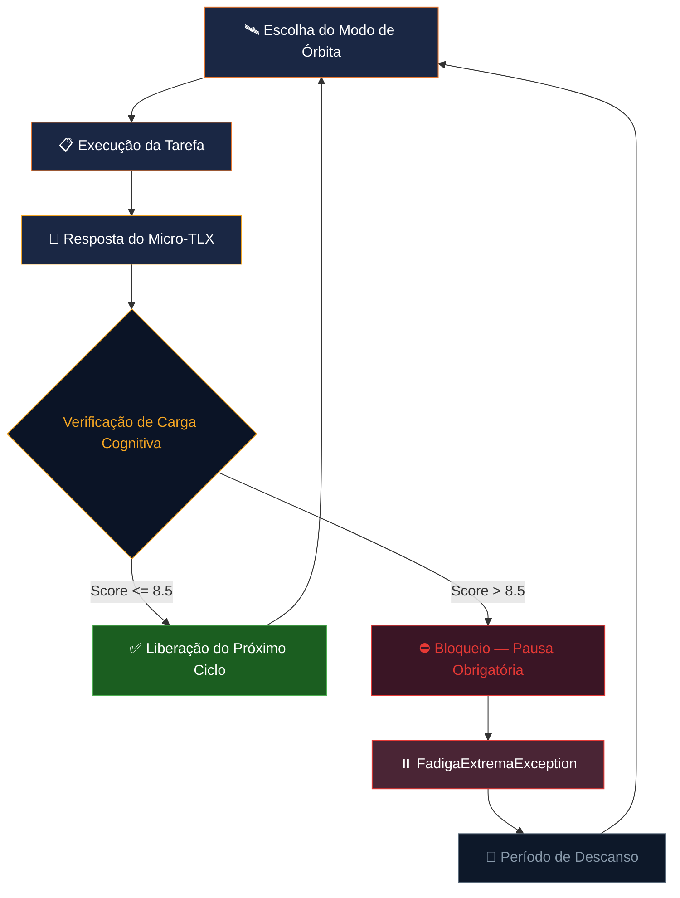

# 🚀 AstroHabits Mission Control Desktop

**Sistema desktop de gerenciamento de carga cognitiva para astronautas**, inspirado em pesquisas da NASA/ESA sobre modulação de hábitos em ambientes de confinamento espacial prolongado.

O AstroHabits integra conceitos de **cronobiologia**, **NASA Task Load Index (TLX)** e **comunicação assíncrona espacial** para ajudar o usuário a gerenciar sua carga mental, modular interrupções e manter um ciclo de trabalho sustentável.

## 📋 Funcionalidades Principais

### 🧠 Gerenciador de Carga Cognitiva (Micro-TLX)
Versão reduzida do NASA-TLX com 3 dimensões ponderadas:
| Dimensão | Peso | Descrição |
|----------|------|-----------|
| Demanda Mental | 1.0 | Esforço cognitivo exigido pela tarefa |
| Esforço | 0.8 | Quão árduo foi concluir a atividade |
| Frustração | 0.6 | Nível de irritação ou estresse gerado |

O score ponderado é calculado em tempo real e classifica a carga como **Baixa**, **Moderada**, **Alta** ou **Crítica**. Scores acima de **8.5** disparam uma `FadigaExtremaException`, bloqueando novos ciclos até pausa obrigatória.

### 🛰️ Modulação de Comunicação Assíncrona (Modos de Órbita)
Simula os delays reais de comunicação espacial para controlar notificações:
| Modo | Delay | Uso Ideal |
|------|-------|-----------|
| 🛰️ Órbita Baixa | 0 min | Tarefas colaborativas em tempo real |
| 🌙 Lua | 5 min | Foco intermediário com entregas em lote |
| 🔴 Marte | 20 min | Foco profundo, comunicação altamente assíncrona |

### 🌗 Interface Circadiana Dinâmica
A interface se adapta automaticamente de acordo com o horário, seguindo as fases do ciclo circadiano:
| Fase | Horário | Comportamento |
|------|---------|--------------|
| 🔥 Foco Intenso | 08:00–12:00 | Máxima performance cognitiva |
| 🔄 Transição | 12:00–14:00 | Redução de carga pós-almoço |
| ⚡ Foco Moderado | 14:00–18:00 | Tarefas regulares |
| 🌙 Descanso | 18:00–08:00 | Recuperação, evitar carga intensa |

## 🏗️ Arquitetura

O projeto segue uma estrutura **Clean Architecture** com separação clara de responsabilidades:

```
/src
├── Domain/
│   ├── Entities/          → Usuario, Tarefa, MicroTlxRegistro, CoordenadasTempo (struct)
│   ├── Enums/             → FaseCircadiana
│   ├── ModosFoco/         → ModoFocoBase (abstract), ModoOrbitaBaixa, ModoLua, ModoMarte
│   ├── Interfaces/        → IRepositorio<T>, INotificacaoManager
│   ├── Exceptions/        → FadigaExtremaException, FalhaTransmissaoMarteException
│   └── Static/            → CalculadoraCargaMental
├── Infrastructure/
│   └── Data/              → JsonRepositorio<T>, NotificacaoManager
├── Partial/               → GerenciadorMissao.Core.cs, GerenciadorMissao.Logs.cs
└── Presentation/
    ├── Views/             → Dashboard, Tarefas, ModoFoco, MicroTlx, Histórico
    └── ViewModels/        → MVVM ViewModels para cada view
```

### Conceitos de POO Demonstrados

| Conceito | Implementação |
|----------|--------------|
| **Herança** | `ModoOrbitaBaixa`, `ModoLua`, `ModoMarte` herdam de `ModoFocoBase` |
| **Polimorfismo** | Método abstrato `CalcularDelayNotificacao()` com implementações distintas |
| **Abstração** | Interfaces `IRepositorio<T>` e `INotificacaoManager` |
| **Encapsulamento** | Propriedades `get; private set` em `Usuario`, `Tarefa`, `MicroTlxRegistro` |
| **Classe Estática** | `CalculadoraCargaMental` com métodos matemáticos puros |
| **Struct** | `CoordenadasTempo` para dados imutáveis de tempo de tela |
| **Partial Class** | `GerenciadorMissao` separado em `.Core.cs` (lógica) e `.Logs.cs` (histórico) |
| **Exceções Customizadas** | `FadigaExtremaException` e `FalhaTransmissaoMarteException` |

## 📊 Diagrama de Fluxo



## 🛠️ Tecnologias

- **.NET 10** (net10.0)
- **Avalonia UI 12.0.4** — Framework cross-platform para desktop
- **Avalonia Fluent Theme** — Tema visual base (Dark)
- **System.Text.Json** — Persistência local em arquivos JSON
- **MVVM Pattern** — Separação de responsabilidades UI/lógica

## 🚀 Como Executar

```bash
# Clone o repositório
git clone <url-do-repo>
cd AstroHabitsDesktop

# Restaurar dependências e executar
dotnet restore
dotnet run
```

### Requisitos
- .NET 10 SDK
- Sistema operacional: Windows, Linux ou macOS

## 📁 Dados Persistidos

Os dados são salvos automaticamente em formato JSON em:
- **Linux/macOS**: `~/.config/AstroHabits/data/`
- **Windows**: `%APPDATA%/AstroHabits/data/`

Arquivos gerados:
- `tarefas.json` — Lista de tarefas/missões
- `microtlx.json` — Histórico de avaliações Micro-TLX

## 📸 Telas do Sistema

### Dashboard
Resumo completo do estado da missão: fase circadiana atual, modo de órbita ativo, último score de carga cognitiva e status das tarefas.

### Gerenciador de Tarefas
CRUD completo de tarefas com status (Pendente → Em Andamento → Concluída) e cálculo automático de TimeSpan.

### Modo Foco (Comunicação Assíncrona)
Seleção visual de modo de órbita com simulação de fila de notificações retidas e despacho em lote.

### Micro-TLX
Formulário com 3 sliders (0–10) e cálculo de score ponderado em tempo real com alerta de fadiga extrema.

### Histórico
Lista completa de registros TLX com estatísticas (média, tendência) e logs da missão.

## 👥 Equipe

Projeto acadêmico desenvolvido para a disciplina de Programação .NET.

---

*AstroHabits Mission Control — Modulando hábitos para missões de longa duração* 🚀
